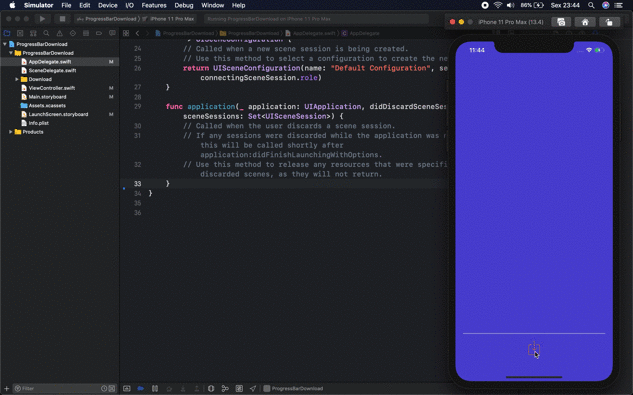

<h1 align="center">Welcome to ProgressBarDownload 👋</h1>

  

  
  
  
  

> <h1 align=&#34;center&#34;>Welcome to ProgressBarDownload 👋</h1> 
       

### 🏠 [Homepage](https://github.com/MaatheusGois/ProgressBarDownloadTemplate#readme)

## Author

👤 **Matheus Gois <matheusgoislimasilva@gmail.com>**

* Website: www.linkedin.com/in/maatheusgois/

* Twitter: [@maatheusgois](https://twitter.com/maatheusgois)

* GitHub: [@maatheusgois](https://github.com/maatheusgois)  

* LinkedIn: [@maatheusgois](https://linkedin.com/in/maatheusgois)

* Dribbble: [@maatheusgois](https://dribbble.com/maatheusgois)

## 🤝 Contributing

Contributions, issues and feature requests are welcome! Feel free to check [issues page](https://github.com/MaatheusGois/ProgressBarDownloadTemplate/issues). You can also take a look at the [contributing guide](https://github.com/MaatheusGois/ProgressBarDownloadTemplate/blob/master/CONTRIBUTING.md).

## Show your support

Give a ⭐️ if this project helped you!

## 📝 License

Copyright © 2020 [Matheus Gois <matheusgoislimasilva@gmail.com>](https://github.com/MaatheusGois). 
This project is [MIT](https://github.com/MaatheusGois/ProgressBarDownloadTemplate/blob/master/LICENSE) licensed.

***
_For God so loved the world that he gave his one and only Son, that whoever believes in him shall not perish but have eternal life. 🙌🏻 John 3:16 [read-the-bible](https://biblia.com/bible/esv/john/3/16)_

_This README was generated with ❤️ by [readme-md-generator](https://github.com/kefranabg/readme-md-generator)_

